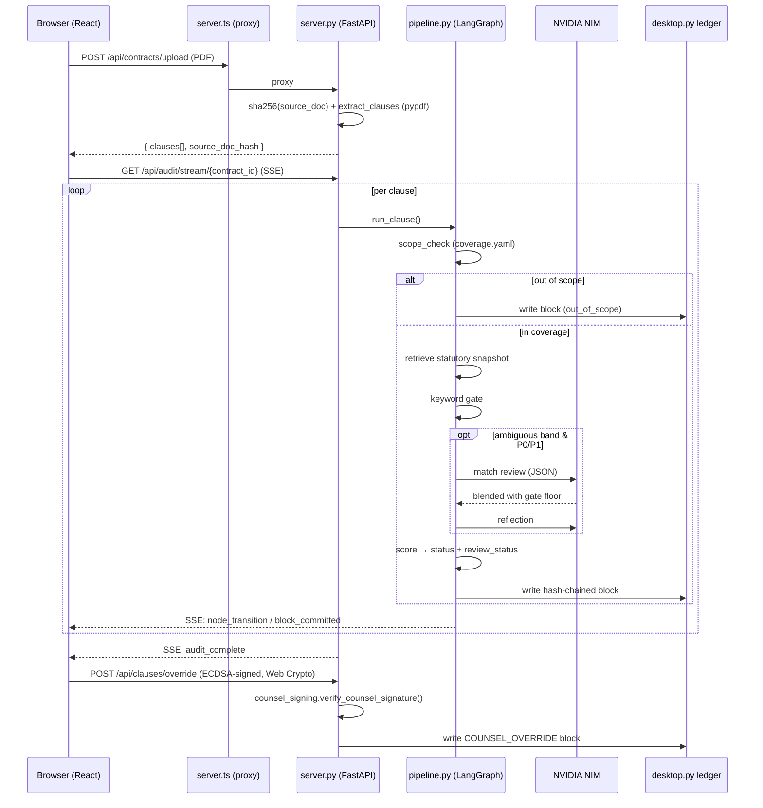

# Solari — Compliance Auditor · Architecture

Deep-dive companion to [README.md](./README.md). Covers the module map, the
full request lifecycle, the API surface, and the data schemas.

## 1. System diagram

```
┌────────────────────────────────────────────────────────────────────┐
│ Browser (React 19 · TypeScript · Tailwind 4 · Vite)                │
│  src/App.tsx + views · hooks/useAuditStore · api/complianceClient  │
│  utils/counselSigning.ts (ECDSA P-256, Web Crypto)                 │
└──────────────┬─────────────────────────────────────────────────────┘
               │ fetch('/api/...') + EventSource (SSE)
               ▼
┌────────────────────────────────────────────────────────────────────┐
│ server.ts (Express · :3000)                                        │
│  NO business logic. Dev: Vite middleware. Prod: serves dist/.      │
│  Reverse-proxies /api/* → SOLARI_API_TARGET (default :8000)        │
└──────────────┬─────────────────────────────────────────────────────┘
               │ HTTP
               ▼
┌────────────────────────────────────────────────────────────────────┐
│ server.py (FastAPI · :8000) — THE ONLY BACKEND                     │
│                                                                    │
│  POST /api/contracts/upload ──┐                                    │
│  POST /api/audit/run          │   ┌──────────────────────────────┐ │
│  GET  /api/audit/stream/:id ──┼──►│ pipeline.py (LangGraph)      │ │
│  GET  /api/clauses            │   │ retrieve → match → (retry?)  │ │
│                               │   │   → reflect → score → log    │ │
│                               │   └─────────┬────────────────────┘ │
│                               │             │                      │
│  ┌──────────────┐   ┌─────────▼────────┐   ┌▼───────────────────┐  │
│  │ coverage.py  │   │ surfaces/desktop │   │ surfaces/browser   │  │
│  │ coverage.yaml│   │  pypdf extract   │   │ statutory snapshot │  │
│  │ + texts.yaml │   │  LEDGER WRITER   │   │ (live fetch opt-in)│  │
│  └──────────────┘   │  (single writer) │   └│──────────────────┘  │
│                     └────────┬─────────┘                          │
│                              ▼                                    │
│                     data/ledger.json (hash chain)                 │
│                              ▲                                    │
│  POST /api/clauses/override ─┤ counsel_signing.py (ECDSA verify)  │
│  GET  /api/ledger[/verify] ──┘                                    │
└──────────────┬─────────────────────────────────────────────────────┘
               │
               ▼
   NVIDIA NIM (nvidia/nemotron-3-ultra-550b-a55b) — match + reflect,
   only in the ambiguous band, only on P0/P1 sources
```

## 2. Audit lifecycle (per clause)

1. **scope_check** — `get_coverage(jurisdiction, topic)`. No cell → clause is
   extracted, logged `out_of_scope`, pipeline never runs. Never force-matched.
2. **retrieve_regulations** — deterministic statutory snapshot from
   `config/statutory_texts.yaml` (via `StatutorySourceProvider`; live fetch only
   with `SOLARI_LIVE_FETCH=1`).
3. **corrective_match** — keyword gate: coverage ratio against **that cell's own**
   `mandatory_terms`. LLM call only when score ∈ [0.45, 0.85] or obligations are
   missing AND the cell is P0/P1. LLM output blends with the deterministic floor;
   it can never override it below the gate. `route_after_match` can loop back to
   retrieve (bounded by `retry_count`).
4. **reflect** — second LLM call critiques LLM-reviewed matches; otherwise a
   heuristic note records what's missing.
5. **score** — maps to a `CoverageStatus`; `gaps_flagged`/`conflict_or_absent`
   auto-set `review_status = flagged_for_counsel`.



## 3. Backend module map (Python)

| Module | Responsibility |
|---|---|
| `server.py` | FastAPI app. All HTTP routes, CORS (`SOLARI_ALLOWED_ORIGINS`), upload handling to `data/uploads/`, SSE audit stream, ledger read/verify endpoints, review queue. Contains **no** scoring logic itself. |
| `pipeline.py` | LangGraph `StateGraph(ClauseState)` with nodes `retrieve_regulations → corrective_match → reflect → score → log`; conditional re-route from match back to retrieve. Owns the NIM client (fixture replay when `SOLARI_TEST_FIXTURES=1`), the 0.45–0.85 ambiguity band, defensive JSON extraction, and the PII-sanitized prompt path. |
| `coverage.py` | Loads and validates `config/coverage.yaml` + `config/statutory_texts.yaml`. Exposes `get_coverage()`, `get_statute_text()`, `coverage_summary()` — the coverage matrix is data, never hardcoded. |
| `state.py` | Central data model: `CoverageStatus`, `ReviewStatus`, `AUTO_FLAG_STATUSES`, pydantic models (`StatutoryCitation`, `MatchEvaluation`, `ReflectionReport`, `AuditScoreOutput`), `ClauseState` TypedDict. Phase-0 vocabulary rename lives here with rationale. |
| `counsel_signing.py` | Server-side ECDSA P-256 verification of counsel overrides over a canonical payload. Returns attempted/verified/reason — `verified` is never a client-asserted claim. Independently re-run by `/api/ledger/verify`. |
| `surfaces/desktop.py` | Desktop surface: PDF clause extraction (`pypdf`, no OCR — clean fallback with logged warning), topic detection, PII sanitization (`sanitize_pii`), and the **single ledger writer** appending SHA-256 hash-chained blocks to `data/ledger.json`. |
| `surfaces/browser.py` | `StatutorySourceProvider`: serves the verified dated snapshot; live statutory fetch only when `SOLARI_LIVE_FETCH=1`, best-effort with snapshot fallback. |
| `main.py` | CLI entry point: `python main.py <pdf_path> <contract_id>` — runs `audit_contract` end-to-end without the HTTP layer. |

## 4. Frontend module map (TypeScript/React)

| Module | Responsibility |
|---|---|
| `server.ts` | Express shell. Dev: mounts Vite middleware. Prod: serves `dist/`. Proxies `/api/*` to `SOLARI_API_TARGET`. **No** scoring, ledger, or LLM logic. |
| `src/App.tsx` | View routing and layout composition. |
| `src/hooks/useAuditStore.ts` | Central audit state store (clauses, verdicts, queue, ledger blocks). |
| `src/api/complianceClient.ts` | Every backend call: health, coverage, clauses, upload, SSE audit stream, signed counsel override, ledger fetch/verify with client-side zero-trust fallback (`cryptoLedger`), review queue, source viewer fetch. Fails closed when the backend is unreachable. |
| `src/utils/counselSigning.ts` | Generates/holds the browser ECDSA P-256 keypair (Web Crypto) and signs override payloads canonically. |
| `src/utils/cryptoLedger.ts` | Client-side SHA-256 hash-chain re-verification + Merkle root, used when the backend is offline. |
| `src/utils/pdfExtractor.ts` | Client-side PDF text extraction (pdfjs-dist) for preview; extraction of record is backend-side. |
| `src/utils/verdict.ts` · `auditRecordPackager.ts` | Verdict display mapping (canonical `CoverageStatus` vocabulary) and report/proof-bundle packaging. |
| `src/types.ts` | Shared domain types (`CoverageCell`, `PipelineLogEntry`, `AuditLedgerBlock`, …). |
| `src/components/views/` | 9 views: ContractOverview, ClausesManifest, ClauseAudit, AuditPipelineLogs, ComplianceRepos, ReviewQueue, CounterpartyDiff, HashChainVisualizer, PythonCode (live source via `/api/source/`). |
| `src/components/modals/` | 6 modals: UploadPdf, ReRunAudit, Override (signed), RedlineEditor, ExportPdf, Json. |
| `src/components/` | Header, Sidebar, TauriTitlebar (desktop shell), HashPatternSeal. |
| `src/data/mockData.ts` | Demo/canonical clause data used when a PDF yields no extractable text. |


## 5. API reference (`server.py`)

All routes are served by the FastAPI backend on `:8000` and proxied by
`server.ts` under `/api`. (Note: the frontend's "Reset Benchmark" calls
`POST /api/ledger/reset`, which is not yet implemented server-side — the
client degrades gracefully with a warning.)

| Method & path | Purpose | Notes |
|---|---|---|
| `GET /api/health` | Liveness + config status | Returns version, `langgraph_available`, `nvidia_api_key_configured` |
| `GET /api/coverage` | The coverage matrix | `{cells: [...]}` — drives tier badges; nothing is hardcoded in components |
| `GET /api/source/{path}` | Live repo file contents for the in-app code viewer | Allowlisted paths only; 404 otherwise |
| `GET /api/clauses?pdf_path=` | Extract clauses from a PDF | `{contract_id, clauses[], total_clauses}` |
| `POST /api/audit/run` | Run the full pipeline synchronously | Body: `{contract_id, contract_text_or_path}`; 503 if LangGraph unavailable |
| `POST /api/contracts/upload` | Authoritative ingestion | Multipart `file` + `contract_id`; SHA-256s the source doc, saves to `data/uploads/`, extracts clauses |
| `GET /api/audit/stream/{contract_id}` | **SSE** live audit stream | Events: `clauses_extracted`, `node_transition`, `block_committed`, `audit_complete` |
| `POST /api/clauses/override` | Counsel override | Body: `OverrideRequest` (contract/clause/verdict, counsel name/email/bar number, justification, optional `signature` + `public_key`). Server re-verifies the ECDSA signature; unsigned overrides are recorded with `signature_verified: null` — never a silent true |
| `GET /api/ledger` | Full hash chain | `{blocks[], count}` |
| `GET /api/ledger/verify` | Chain integrity check | Recomputes every hash link **and** re-verifies any `COUNSEL_OVERRIDE` signatures; returns `valid`, `reason`, Merkle root |
| `GET /api/review-queue` | First-class review queue | Items flagged `flagged_for_counsel` not yet resolved by an override: `{clause_id, contract_id, status, flagged_at, block_hash}` |

## 6. Data formats

### Coverage cell (`config/coverage.yaml`)

```yaml
- jurisdiction: US            # US | EU | UK | ZA | LS
  topic: data_privacy         # data_privacy | employment | communications
  tier: P0                    # P0 full | P1 provisional | P2 heuristic-only
  statute_id: ftc-safeguards-16-cfr-314
  law_code: "16 CFR §314"
  source_url: "https://..."
  mandatory_terms:
    - term: "multi-factor authentication"
      provision: "16 CFR 314.4(c)(5)"   # pinpoint citation
      verified: true                     # false = best-effort, not checked
```

`tests/test_scoring.py` fails the suite if any cell has an invalid tier or an
empty vocabulary.

### Ledger block (`data/ledger.json`, one JSON object per line)

```json
{
  "contract_id": "contract-001",
  "timestamp": "2026-09-30T12:00:00Z",
  "previous_block_hash": "<sha256 of previous block>",
  "log_entries": [ {"stage": "...", "surface": "...", "message": "..."} ],
  "metadata": {
    "clause_id": "clause-1",
    "status": "gaps_flagged",
    "review_status": "flagged_for_counsel",
    "calibrated_score": 0.65,
    "model": "nvidia/nemotron-3-ultra-550b-a55b"
  },
  "block_hash": "<sha256 over the canonical block>"
}
```

Counsel-override blocks add to `metadata`: `action: "COUNSEL_OVERRIDE"`,
counsel fields, `signature`, `public_key`, `public_key_fingerprint`,
`signature_attempted`, `signature_verified` (tri-state), `signature_reason`.

### Pipeline state & verdicts (`state.py`)

- `CoverageStatus`: `baseline_met` · `gaps_flagged` · `conflict_or_absent` ·
  `out_of_scope` (routing state, not a verdict)
- `ReviewStatus`: `unreviewed` · `flagged_for_counsel` · `counsel_approved` ·
  `counsel_rejected` — `AUTO_FLAG_STATUSES` = gaps/conflict
- `MatchEvaluation`: `matched`, `calibrated_score` (the gate), `llm_reviewed`,
  `llm_confidence`, `statutory_citation`, `missing_obligations[]`,
  PII-sanitized clause text
- `StatutoryCitation`: law code + title + snippet + source URL +
  `statute_retrieved_at` + per-term `missing_provisions` (pinpoint `provision`
  is `null` and `verified: false` when not independently checked — never fabricated)

## 7. Environment & test modes

| Variable | Effect |
|---|---|
| `NVIDIA_API_KEY` | Absent → every match is keyword-gate only (`llm_reviewed=false`) |
| `SOLARI_ALLOWED_ORIGINS` | CORS allowlist (default `http://localhost:3000`) |
| `SOLARI_API_TARGET` | Proxy target for `server.ts` (default `http://localhost:8000`) |
| `SOLARI_LIVE_FETCH=1` | Best-effort live statutory fetch before snapshot fallback |
| `SOLARI_TEST_FIXTURES=1` | NIM calls replay `tests/fixtures/*.json`; deterministic offline CI |

Fixture files are named by statute id (e.g.
`tests/fixtures/match_ftc-safeguards-16-cfr-314.json`) and cover both the match
and reflection calls, giving the LLM-blending logic real regression tests
without network access.

6. **log** — single-writer SHA-256 hash-chained block via `surfaces/desktop.py`.
